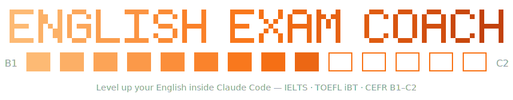

<p align="center">
  
</p>

<p align="center">
  <a href="https://github.com/OleksiiDotsenko/english-exam-coach/actions/workflows/tests.yml"></a>
  
  
  
  
</p>

**English Exam Coach** turns [Claude Code](https://claude.com/claude-code)
into your personal English exam tutor. It generates original practice tasks
in the exact format of your exam, grades your answers with feedback that
actually tells you what to fix, and keeps a practice log on your own disk —
so every session shows you your trend, your weakest task type, and the one
thing to drill next.

> [!IMPORTANT]
> **Indicative, not official.** All scores and level estimates are
> self-practice feedback — they are not official results and do not predict
> them. This project is not affiliated with, endorsed by, or connected to
> IELTS, ETS/TOEFL, Cambridge English, or any exam board; exam names are
> used nominatively to describe compatibility.

## 🧡 What you can do

- 📝 **Writing** — paste your essay, email, or report; get a band range, a
  CEFR level, and rewrites built from *your own sentences*
- 🗣️ **Speaking** — exam-format prompts with real timings; feedback on a
  transcript or recording description
- 📖 **Reading & Use of English** — cloze, key word transformations,
  matching, True/False/Not Given… scored objectively, every answer explained
- 🎧 **Listening** — generated scripts with exam-style questions (spoken
  aloud on macOS, read-along elsewhere)
- 🧠 **Vocabulary** — leveled word sets with spaced repetition that
  remembers what you keep forgetting
- 🗓️ **Study plan** — tell it your exam date; get a week-by-week plan it
  checks you against
- 📈 **Progress** — every attempt logged locally; reports show trends and
  pick your next drill

## 🚀 Get started in 2 minutes

You need [Claude Code](https://claude.com/claude-code) and Python 3
(preinstalled on macOS and most Linux; Windows: [python.org](https://www.python.org/downloads/)).

**1.** Open a terminal and start Claude Code:

```bash
claude
```

*(New to Claude Code? [Install it first](https://claude.com/claude-code),
then run `claude` from any folder.)*

**2.** Inside Claude Code, run these two commands **one at a time** —
paste the first, press Enter, wait for the ✔, then paste the second:

```
/plugin marketplace add OleksiiDotsenko/english-exam-coach
```

```
/plugin install english-exam-coach@english-exam-coach
```

> Using the **desktop or web app** — or seeing *"/plugin isn't available
> in this environment"*? Skip step 1 and run both commands from a plain
> terminal instead, prefixed with `claude`:
>
> ```bash
> claude plugin marketplace add OleksiiDotsenko/english-exam-coach
> claude plugin install english-exam-coach@english-exam-coach
> ```

**3.** Restart Claude Code (type `/exit`, then `claude` again — or just
open a new session in the app) and type:

```
/start-prep
```

That's it — it asks which exam you're preparing for, finds your level, and
starts your first task. Prefer talking? Just say *"help me prepare for
TOEFL"* or *"here's my IELTS essay: …"* — the right skill fires on its own.

| Say / run | What happens |
|---|---|
| `/start-prep` | Guided start: pick exam → level → section → practice |
| `/assess-level toefl-ibt` | 15-minute CEFR diagnostic, logged as your baseline |
| "Give me a C1 key word transformation drill" | Original items, objective scoring, explanations, logged |
| "Here's my IELTS Task 2 essay: …" | Criteria-based feedback, band range + CEFR level, prioritized rewrites, logged |
| `/mock-exam cefr-c1 reading` | Full timed section, no hints, scored and logged |
| `/daily-drill` | 10–15 min drill on your weakest task type from the log |
| `/session-report` · `/progress` | Markdown reports for the session / all time |

## 🕹️ Example session

```text
You:    /start-prep
Claude: Which exam are you preparing for? (IELTS Academic / IELTS General /
        TOEFL iBT / CEFR B1–C2)
You:    TOEFL, writing
Claude: TOEFL iBT Writing has three task types: Build a Sentence,
        Write an Email (7 min), Academic Discussion (10 min).
        Practice a new task, or get feedback on something you wrote?
You:    new email task
Claude: [original Write-an-Email task: scenario + 3 required content
        points, 7-minute timer starts when you say go]
You:    [your email]
Claude: Band estimate: 4.5–5.0 / 6 (≈ B2, borderline C1).
        All 3 content points covered; register consistent.
        Priority fixes: (1) …, (2) …, (3) … — each shown as a rewrite
        of your own sentences. Attempt logged.
You:    /session-report
Claude: [table of today's attempts, time on task, weakest task type,
        one recommended next drill]
```

## 📚 Supported exams

| exam id | Exam | CEFR anchor | Scale |
|---|---|---|---|
| `ielts-academic` | IELTS Academic | B1–C2 | Bands 0–9 |
| `ielts-general` | IELTS General Training | B1–C2 | Bands 0–9 |
| `toefl-ibt` | TOEFL iBT (2026 format) | A1–C2 | Bands 1–6, half steps |
| `cefr-b1` | B1 Preliminary | B1 | Cambridge English Scale |
| `cefr-b2` | B2 First | B2 | Cambridge English Scale |
| `cefr-c1` | C1 Advanced | C1 | Cambridge English Scale |
| `cefr-c2` | C2 Proficiency | C2 | Cambridge English Scale |

Format facts (task types, item counts, timings, word counts, scales) live in
[data/exam-formats/](plugins/english-exam-coach/data/exam-formats/) and were
verified against official sources in July 2026 — including the redesigned
TOEFL iBT (adaptive sections, 1–6 band scale). Formats change occasionally;
confirm details with the exam provider before test day.

## 📈 Your progress, on your disk

Two layers, both plain files in your own workspace (never inside the plugin):

- `attempts.jsonl` — append-only log, one line per scored attempt.
  **Source of truth.** The tooling only ever appends; "clearing progress"
  is a deliberate manual action (delete the file yourself), never a side
  effect.
- `reports/*.md` — session reports and an all-time overview, regenerable
  at any time.

Cross-exam trends are normalized to CEFR — an IELTS band and a TOEFL score
are never merged into one number.

**Where the files live** (first match wins): the `--base` flag →
`EXAM_COACH_HOME` env var → `~/english-exam-coach/` (created on first use).

> [!TIP]
> **Obsidian user?** Point `EXAM_COACH_HOME` at a folder inside your vault
> and the reports' YAML frontmatter (`type`, `date`, `session`, `tasks`,
> `minutes`, `exams`) makes Dataview tables and trend views work with no
> extra code.

## ❓ FAQ

<details>
<summary><b>Does it cost anything extra?</b></summary>

No separate account, API key, or subscription — it runs inside your
existing Claude Code session.
</details>

<details>
<summary><b>Where does my data go?</b></summary>

Nowhere. The plugin makes zero network calls and sends no telemetry. Your
practice log is a local file in a folder you choose.
</details>

<details>
<summary><b>Will it predict my real exam score?</b></summary>

No — and be suspicious of anything that claims to. Estimates are honest
ranges tied to public CEFR descriptors: good enough to steer your practice,
not an official measurement.
</details>

<details>
<summary><b>The commands don't show up after installing</b></summary>

Start a new Claude Code session (or restart the app) — plugins load at
session start.
</details>

<details>
<summary><b>"SSH authentication failed" when adding the marketplace</b></summary>

Two common causes. (1) Both install lines were pasted at once — the second
line becomes extra arguments of the first and mangles the repository
address. Run the commands one at a time. (2) If a clean, single command
still tries SSH, add the marketplace by its HTTPS URL instead:
<code>/plugin marketplace add
https://github.com/OleksiiDotsenko/english-exam-coach</code>. No SSH key
is ever required — the repository is public.
</details>

<details>
<summary><b>"/plugin isn't available in this environment"</b></summary>

The <code>/plugin</code> dialog only exists in the terminal version of
Claude Code. In the desktop or web app, run the equivalent commands from
any terminal: <code>claude plugin marketplace add
OleksiiDotsenko/english-exam-coach</code>, then <code>claude plugin
install english-exam-coach@english-exam-coach</code>. The plugin then
works in every Claude Code surface on that machine.
</details>

<details>
<summary><b>Can it play listening audio?</b></summary>

On macOS it speaks scripts aloud via the built-in <code>say</code> command.
Elsewhere, listening drills degrade gracefully to read-once scripts —
or bring your own audio/podcast and it builds questions for that.
</details>

<details>
<summary><b>How do I update or uninstall?</b></summary>

Update: <code>/plugin marketplace update english-exam-coach</code>, then
<code>/plugin update english-exam-coach@english-exam-coach</code> (the full
<code>name@marketplace</code> form is required here). Uninstall:
<code>/plugin uninstall english-exam-coach</code>. Your progress files are
yours and are never touched by either.
</details>

## 🔒 Security & privacy

- **No network access.** No network calls, no telemetry; everything runs
  locally in your Claude session.
- **No MCP servers, no hooks, no background processes** — only Markdown
  skills/commands and two Python scripts invoked explicitly.
- **Writes only to your progress directory** — nothing else on disk is
  touched, and the attempt log is opened in append mode only.
- **Standard library only.** The scripts import nothing outside Python's
  stdlib, so there is no supply-chain surface.

## 🧩 What's inside

- **8 skills**, organized by macro-skill, not by exam (exam differences are
  reference data, not code): `exam-router`, `writing-evaluator`,
  `speaking-coach`, `reading-use-of-english`, `listening-trainer`,
  `vocabulary-builder`, `study-planner`, `progress-tracker`.
- **6 commands:** `/start-prep`, `/mock-exam`, `/daily-drill`,
  `/assess-level`, `/session-report`, `/progress`.
- **Data:** exam format facts, paraphrased public CEFR descriptors, and a
  small bank of original seed items used as format references.
- **Scripts:** `log_attempt.py` and `build_report.py` — Python 3 standard
  library only.

## ⚖️ Content and IP policy

- **No official exam content.** No past papers, official item banks, or
  official mark schemes anywhere in this repository. All practice items are
  original, generated to match public *format facts* (task types, counts,
  timings, scales — facts are not copyrightable).
- **Public descriptors only.** Evaluation anchors are paraphrased from the
  public CEFR framework (Council of Europe); criterion *names* are used
  nominatively.
- **Brand-neutral naming.** Files and identifiers are named by CEFR level
  where possible; trademarks appear only nominatively, with no claim of
  affiliation or endorsement.

If you believe any content in this repository crosses these lines, please
open an issue — it will be treated as a bug.

## 🛠️ Development

```bash
python3 -m unittest discover -s tests      # from the repo root
claude plugin validate . --strict
python3 tools/make_banner.py               # regenerate assets/banner.svg
```

Design notes: skills are procedures, exam differences are reference data
loaded on demand; the progress log is append-only and reports are derived.
See [CHANGELOG.md](CHANGELOG.md) for release history.

## License

[MIT](LICENSE) © 2026 Oleksii Dotsenko
