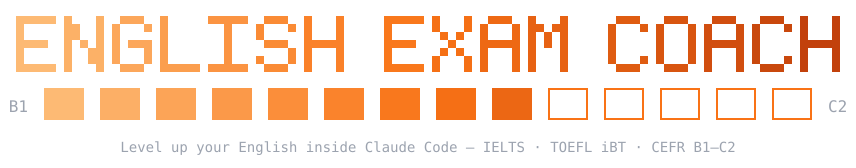

<p align="center">
  
</p>

<p align="center">
  <a href="https://github.com/OleksiiDotsenko/english-exam-coach/actions/workflows/tests.yml"></a>
  
  
  
  
</p>

**English Exam Coach** turns [Claude Code](https://claude.com/claude-code)
into an English exam tutor. It sets original practice in the exact format of
your exam, grades it with feedback that tells you what to fix, and keeps a
record on your own disk — so every session knows your trend, your weakest
task type, and the one thing to drill next.

New in 3.0: it works for **tutors** too. Log a student's full test from any
platform, review it against their earlier tests, see which mistakes are
habits, and print practice sheets with answer keys.

> [!IMPORTANT]
> **Indicative, not official.** All scores and level estimates are
> self-practice feedback — they are not official results and do not predict
> them. This project is not affiliated with, endorsed by, or connected to
> IELTS, ETS/TOEFL, Cambridge English, or any exam board; exam names are
> used nominatively to describe compatibility.

## 🔁 It remembers what you got wrong

Most tools grade you and forget. This one keeps a private ledger of your
actual mistakes, schedules them for re-testing, and — the part nothing else
does — **writes a brand-new item on the same point** when it comes back, so
you can never answer from memory of the card.

```text
You:    /daily-drill
Claude: Re-testing 3 points you have missed before — "past perfect after
        'by the time'" is due today; you have got it wrong twice.
        [three fresh items, none of them the ones you saw before]
You:    [your answers]
Claude: 2 right. "By the time" is promoted to next week; the article point
        comes back tomorrow. Attempt and errors logged.
```

Every score also decomposes: instead of "your writing is B2", the report
tells you *which criterion* is holding it there, and says what the estimate
rests on — a typed transcript and a real recording never count the same.

## 🧑‍🏫 For tutors: full tests, habits, paper

A single drill says how one task went. A run of full tests is the only
honest trend line — and laying every mistake across that run is what
separates a slip from a habit.

```text
You:    /review-test Dana "Mock 6"      [score report + her writing attached]
Claude: Logged: R 5.5 · L 5.5 · W 5.5 · S 4.0 → overall 5.0, her record.
        4 mistakes in 4 points — 1 new, 3 seen before:
          missing article before a singular count noun   in 6 of 6 tests
          purpose questions answered with the topic      in 5 of 6 tests
          "adapted" confused with "adopted"              back after 3 clean tests
        Stayed away: third-person -s — 1 clean test, 3 to go.
You:    /worksheet Dana articles
Claude: sheet.html (with key) and sheet-learner.html written — open in a
        browser and print, or save as PDF.
```

- **`coach log-test`** records a test's scores exactly as the test gave them.
- **`coach tests`** shows the history: records, first half against second
  half, per-task detail — and refuses to call two tests a trend.
- **`coach catalog`** is the error catalog: every mistake ranked, a
  point-by-test matrix, mistakes repeated word for word, mistakes carried
  over from the first language, and a **habit state** for every point.
  One rule throughout: a point is *closed* only after **four clean tests in
  a row**. Two clean tests is not closed.
- **`coach render`** turns any report or worksheet into a page that prints
  cleanly — answer key on its own page, or left out for the learner's copy.
- **`--learner <name>`** keeps each student in a folder of their own.

## 🧡 What you can do

- 📝 **Writing** — paste your essay, email or report; get a band range, a
  CEFR level, and rewrites built from *your own sentences*
- 🗣️ **Speaking** — exam-format prompts under the real clock; feedback on a
  transcript, or on a recording if you have a local speech recogniser
- 📖 **Reading & Use of English** — cloze, key word transformations,
  matching, True/False/Not Given… scored objectively, every answer explained
- 🎧 **Listening** — original scripts with exam-style questions, spoken by
  your computer's own voices on macOS and Linux, read-once elsewhere
- 🧠 **Vocabulary** — levelled word sets with spaced repetition
- 🗓️ **Study plan** — tell it your exam date; get a week-by-week plan it
  checks you against
- 📈 **Progress** — every attempt logged locally; reports show trends and
  pick your next drill
- 🧾 **Full-test review, error catalog, printable sheets** — see above

## 🚀 Get started in 2 minutes

You need [Claude Code](https://claude.com/claude-code) and Python 3.8 or
newer. Most Linux distros include it; on macOS you may be prompted to
install the Command Line Tools the first time (`xcode-select --install`) or
grab it from [python.org](https://www.python.org/downloads/); on Windows,
install from [python.org](https://www.python.org/downloads/).

**1.** Open a terminal and start Claude Code:

```bash
claude
```

**2.** Inside Claude Code, run these two commands **one at a time** —
paste the first, press Enter, wait for the ✔, then paste the second:

```
/plugin marketplace add OleksiiDotsenko/english-exam-coach
```

```
/plugin install english-exam-coach@english-exam-coach
```

> Using the **desktop or web app** — or seeing *"/plugin isn't available
> in this environment"*? Skip step 1 and run both commands from a plain
> terminal instead, prefixed with `claude`:
>
> ```bash
> claude plugin marketplace add OleksiiDotsenko/english-exam-coach
> claude plugin install english-exam-coach@english-exam-coach
> ```

**3.** Start a new session and type:

```
/start-prep
```

That's it — it asks which exam you're preparing for, finds your level, and
starts your first task. Prefer talking? Just say *"help me prepare for
TOEFL"* or *"here's my IELTS essay: …"*.

| Say / run | What happens |
|---|---|
| `/start-prep` | Guided start: exam → level → section → practice |
| `/assess-level toefl-ibt` | 15-minute CEFR check, logged as your baseline |
| "Give me a C1 key word transformation drill" | Original items, objective scoring, explanations, logged |
| "Here's my IELTS Task 2 essay: …" | Criteria-based feedback, band range + CEFR level, prioritised rewrites, logged |
| `/mock-exam toefl-ibt full` | A timed mock — one section or the whole test |
| `/daily-drill` | 10–15 minutes on what your own log says is weakest |
| `/session-report` · `/progress` | Reports for the session / all time |
| `/review-test` | Log and review a full test taken elsewhere |
| `/error-catalog` | What keeps going wrong across tests |
| `/worksheet` | A printable practice sheet with an answer key |

## 📚 Supported exams

| exam id | Exam | CEFR anchor | Scale |
|---|---|---|---|
| `ielts-academic` | IELTS Academic | B1–C2 | Bands 0–9 |
| `ielts-general` | IELTS General Training | B1–C2 | Bands 0–9 |
| `toefl-ibt` | TOEFL iBT (2026 format) | A1–C2 | Bands 1–6, half steps |
| `cefr-b1` | B1 Preliminary | B1 | Cambridge English Scale |
| `cefr-b2` | B2 First | B2 | Cambridge English Scale |
| `cefr-c1` | C1 Advanced | C1 | Cambridge English Scale |
| `cefr-c2` | C2 Proficiency | C2 | Cambridge English Scale |

Format facts (task types, item counts, timings, word counts, scales) live in
[data/exam-formats/](plugins/english-exam-coach/skills/english-exam-coach/data/exam-formats/).
The TOEFL iBT file was re-verified in October 2026 against the exam
provider's published test specifications and its full-length practice test;
the task shapes it describes are pinned by the test suite. Formats change —
confirm details with the exam provider before test day.

**TOEFL item shapes are built by rule.** *Complete the Words* and *Build a
Sentence* have a mechanical shape that is easy to get subtly wrong by hand —
a blank too many, a frame that does not match its tiles. `coach ctest` and
`coach sentence` cut a plain paragraph or sentence into the exact shape and
mark the answers, so an item is always answerable.

## 📈 Your progress, on your disk

Plain files in a folder of your own (never inside the plugin):

- `attempts.jsonl` — one line per scored attempt.
- `errors.jsonl` — the specific points you got wrong.
- `tests.jsonl` — the scores of full tests.
- `queue.json` — when each point is due to come back.
- `profile.json` — your target exam, score and date.
- `reports/` — session reports, the all-time overview, test reviews and the
  error catalog, as Markdown (and HTML when you render them). Always
  regenerable.
- `learners/<name>/` — the same layout again, one per student, in tutor
  mode.

The three logs are **append-only**: nothing is rewritten behind your back,
and a correction is a new line (`--amend`, `--void`) rather than an edit.
JSON state is written atomically, and a file that somehow gets corrupted is
set aside rather than silently discarded. `coach state validate` checks the
directory; `coach state export` packs it into one zip to move or back up.

Cross-exam trends are normalised to CEFR — an IELTS band and a TOEFL score
are never merged into one number.

**Where the files live** (first match wins): the `--base` flag →
`EXAM_COACH_HOME` → `~/english-exam-coach/` (created on first use).

> [!TIP]
> **Obsidian user?** Point `EXAM_COACH_HOME` at a folder inside your vault
> and the reports' YAML front matter (`type`, `date`, `session`, `tasks`,
> `minutes`, `exams`) makes Dataview tables and trend views work with no
> extra code.

## ❓ FAQ

<details>
<summary><b>Does it cost anything extra?</b></summary>

No separate account, API key or subscription — it runs inside your
existing Claude session.
</details>

<details>
<summary><b>Where does my data go?</b></summary>

Nowhere. The plugin makes zero network calls and sends no telemetry. Your
practice log is a set of local files in a folder you choose.
</details>

<details>
<summary><b>Will it predict my real exam score?</b></summary>

No — and be suspicious of anything that claims to. Estimates are honest
ranges tied to public CEFR descriptors: good enough to steer your practice,
not an official measurement.
</details>

<details>
<summary><b>I'm a tutor. Where do my students' results go?</b></summary>

Into <code>learners/&lt;name&gt;/</code> inside your progress folder — one
folder per student, never mixed, never uploaded. Use
<code>coach state export --learner &lt;name&gt;</code> to hand a student
their own history.
</details>

<details>
<summary><b>Can it make a PDF?</b></summary>

It makes a self-contained HTML page laid out for print. Open it in any
browser and print it, or choose "Save as PDF" in the print dialog. No PDF
library is bundled, by design: the scripts are standard library only.
</details>

<details>
<summary><b>Can it play listening audio?</b></summary>

On macOS (<code>say</code>) and Linux (<code>espeak</code>) it speaks
scripts with the system voices, a different voice per speaker. Elsewhere
listening drills fall back to read-once scripts — or bring your own audio
and it builds questions for that.
</details>

<details>
<summary><b>Can it listen to my speaking?</b></summary>

It never records you. If you give it a recording and you already have a
local speech recogniser installed (<code>whisper-cli</code> or
<code>whisper</code>), it transcribes the file on your machine and measures
pace and pauses. Otherwise you paste a transcript. Pronunciation is never
scored.
</details>

<details>
<summary><b>The commands don't show up after installing</b></summary>

Start a new Claude Code session (or restart the app) — plugins load at
session start.
</details>

<details>
<summary><b>"SSH authentication failed" when adding the marketplace</b></summary>

Two common causes. (1) Both install lines were pasted at once — the second
line becomes extra arguments of the first and mangles the repository
address. Run the commands one at a time. (2) If a clean, single command
still tries SSH, add the marketplace by its HTTPS URL instead:
<code>/plugin marketplace add
https://github.com/OleksiiDotsenko/english-exam-coach</code>. No SSH key
is ever required — the repository is public.
</details>

<details>
<summary><b>"/plugin isn't available in this environment"</b></summary>

The <code>/plugin</code> dialog only exists in the terminal version of
Claude Code. In the desktop or web app, run the equivalent commands from
any terminal: <code>claude plugin marketplace add
OleksiiDotsenko/english-exam-coach</code>, then <code>claude plugin
install english-exam-coach@english-exam-coach</code>.
</details>

<details>
<summary><b>How do I update or uninstall?</b></summary>

Update: <code>/plugin marketplace update english-exam-coach</code>, then
<code>/plugin update english-exam-coach@english-exam-coach</code> (the full
<code>name@marketplace</code> form is required here). Uninstall:
<code>/plugin uninstall english-exam-coach</code>. Your progress files are
yours and are never touched by either.
</details>

<details>
<summary><b>Upgrading from 2.x</b></summary>

Your progress folder is read as it is — the logs are additive-only by
contract. What changed is the packaging: the eight skills are now one,
<code>english-exam-coach</code>, and the commands are unchanged. Nothing to
migrate.
</details>

## 🔒 Security & privacy

- **No network access.** No network calls, no telemetry, nothing
  downloaded. Everything runs locally in your Claude session.
- **No MCP servers, no hooks, no background processes.**
- **One bookkeeping tool, provably inert.** `coach.py` and everything it
  can import use the Python standard library only, start no other program
  and open no connection. That is not a promise but a test: the suite
  walks the import graph and fails on any module that could.
- **It writes in one place.** Your progress directory, plus a page or an
  archive you ask for. The logs are opened in append mode only.
- **Harmless wherever it is pointed.** A learner's essay is untrusted text.
  `coach.py` reads only working files (`.txt`, `.md`, `.json`, `.jsonl`,
  links followed), writes pages only to `.html` and archives only to `.zip`,
  and replaces an existing file only if it wrote it. Export and import move
  the files of the progress layout and nothing else. No tool is
  pre-approved — you decide what runs without asking.
- **Three optional helpers start programs already on your machine**, and
  only when a task needs them: `speak.py` and `timed_speak.py` (the system
  speech synthesiser and an audio player), and `transcribe.py` (a speech
  recogniser you installed, on a recording you provide). Audio is rendered
  to a temporary folder and deleted after the drill. Nothing records you.
- **Nothing a report contains can run.** The print renderer escapes all
  HTML, loads no scripts, fonts or images, and links only to ordinary web
  and mail addresses.

## 🧩 What's inside

- **One self-contained skill**, `english-exam-coach`: a short router
  (`SKILL.md`), a reference file per area loaded on demand, reference data,
  and the scripts — all in one folder, so it works wherever a skill's own
  folder is all there is.
- **9 commands:** `/start-prep`, `/assess-level`, `/daily-drill`,
  `/mock-exam`, `/session-report`, `/progress`, `/review-test`,
  `/error-catalog`, `/worksheet`.
- **Data:** exam format facts, paraphrased public CEFR descriptors,
  calibration anchors, a closed error taxonomy, and original seed items
  used as format references.
- **Scripts:** `coach.py` and the modules behind its 15 commands, plus the
  three optional helpers. Python 3 standard library only.

## ⚖️ Content and IP policy

- **No official exam content.** No past papers, official item banks, or
  official mark schemes anywhere in this repository. All practice items are
  original, generated to match public *format facts* (task types, counts,
  timings, scales — facts are not copyrightable). Task instructions are
  written in our own words.
- **Public descriptors only.** Evaluation anchors are condensed and adapted
  from the public CEFR framework (© Council of Europe, freely published);
  criterion *names* are used nominatively. Some short phrases stay close to
  the concise source wording.
- **Brand-neutral naming.** Files and identifiers are named by CEFR level
  where possible; trademarks appear only nominatively, with no claim of
  affiliation or endorsement.

If you believe any content in this repository crosses these lines, please
open an issue — it will be treated as a bug.

## 🛠️ Development

```bash
python3 -m unittest discover -s tests      # from the repo root
claude plugin validate . --strict
claude plugin validate ./plugins/english-exam-coach --strict
python3 tools/make_banner.py               # regenerate assets/banner.svg
```

Design notes: one skill routes to reference files; exam differences are
data, not code; the logs are append-only and every report is derived from
them. [DOGFOOD.md](DOGFOOD.md) lists what the tests cannot prove.
See [CHANGELOG.md](CHANGELOG.md) for release history.

## License

[MIT](LICENSE) © 2026 Oleksii Dotsenko
